# 房地产
## 行业
### 中泰：从库存角度看房地产的政策趋向与投资机会
来源：https://mp.weixin.qq.com/s/FQAiE4Ppm7sqUDvZvzwCsA
* 从绝对规模看，全国住宅库存水平没有达到2014年的历史高点。从相对规模看，考虑销售规模上升，去化周期自2017年以来维持在1.1年，并没有出现因投资过热导致的库存过剩现象，这与以往国内外房地产周期中，高供地叠加需求收缩导致房地产行业危机，有本质性差别，不能将本轮调整与历史上国内外任何一轮房地产危机简单类比。
* 经过5年（2016-2021年）去库存，存在南低北高特点（以黄河为界，华北、西北和东北的库存压力明显）。
* 部分困境房企的项目区域分布不均，导致：
  * 市场差的地方土储多，降价销售回笼资金
  * 市场好的地方土储少，裁员减编不拿地
  * 区域的现金流收支不匹配，需要集团层面调拨资金，受预售资金监管的影响大，引发流动性危机
* 库存不高，为什么市场下行？
  * 行业已形成负反馈机制，市场供需螺旋式下行 
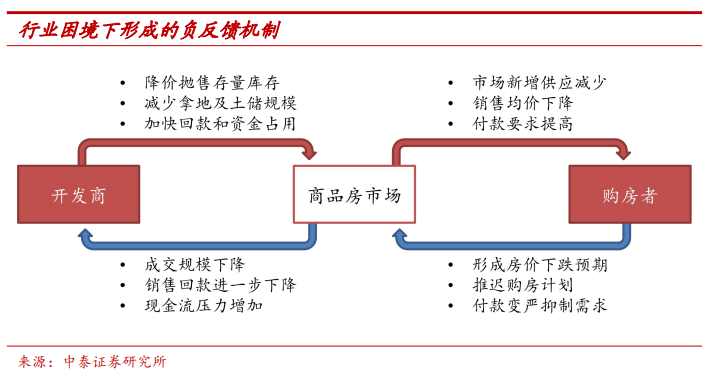
* 库存不高，为什么不拿地？
  * 拿地能力下降：三道红线、融资环境紧缩，有息负债增速持续下降
  * 拿地意愿下降：
    * 2017新房限价以来，房地价差缩小，利润率下行；
    * 囤地模式转向高周转模式，2021年政策环境限制资金使用效率（预售资金监管），周转降速->流动性压力->主动收缩土储规模->总资产规模收缩
* 房企经营思路有什么变化？
  * 土地为王到现金为王：竞地价、限房价为主，预售资金不断规范，囤地难以搏到房价上涨的超额利润，赚取合理的开发利润是行业共识
  * 追求规模到追求稳健：三道红线后，销售规模对获取资本市场融资的影响下降，要活得久而非跑得快
  * 全国扩张到区域深耕：集团资金调拨通道受阻，2018-2021通过扩张管理半径获取超额增长的路径被堵死，区域深耕策略凭借低管控成本优势，将取代全国化快周转策略

### 中金：房地产板块当前六大关键问题
来源：https://mp.weixin.qq.com/s/aC7Z-AOqbkEMjsAE4IdAMA
* 当前行业基本面如何？
  * 中指50城新房周销售面积跌幅扩大且3月没有季节性改善，克而瑞百强房企销售额去年9月跌超30%且逐月扩大，Q1跌幅较2020Q1还大，企业有所分化但央国企Q1跌幅也走阔
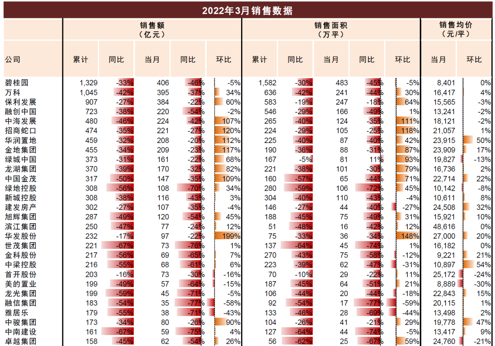
  * 房价
* 新房市场为何如此疲弱？
* 房企困境走到了哪一步？
* 政策在哪些方面还有空间？
* 后市基本面指标将如何演进？
* 如何把握地产股投资机会？

## 城市
### 限购
#### 广发统计  
> 截至2021年的限购城市共72个，创2010年以来新高，当年新增3个；  
> 限购城市的销售面积（金额）占全国25%（45%）。  

广发_限购城市名单  
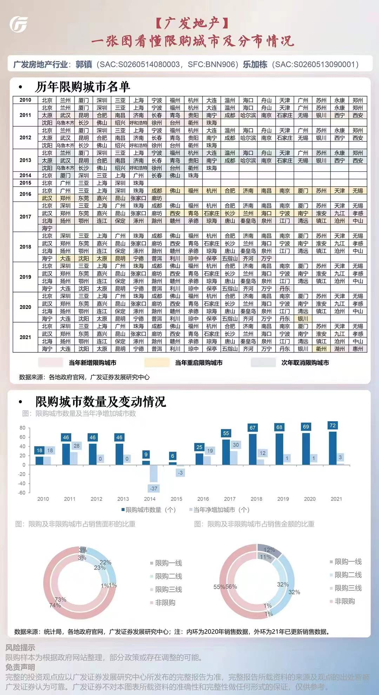

## 企业
### 黑石AUM  
Manhattan-based Blackstone, which reported $279.5 billion in assets under management for its real estate segment in the fourth quarter of 2021, raised about $6.3 billion for its third Asia fund over the same period.  
  
截至2021年底，黑石Blackstone的房地产资产管理规模为2795亿美元（1.8万亿元），2021Q4为其第三支亚洲基金募集了63亿美元。
> 凯德投资2021H的AUM为1190亿新元（5700亿元），是黑石的1/3。  
  
### 中金固收：Top30民营房企分析
来源：https://mp.weixin.qq.com/s/0CG7yvcMRVYmXUAwVxPiSw  

### 浙商地产：代建与保障性住房商业模式研究
来源：https://mp.weixin.qq.com/s/IEqOSXyvofDyA3j6zfy-1Q  
20220218-浙商证券-房地产行业保障性住房商业模式研究：代建的模式有哪些？代建能力怎么评估？

### 对12家房企项目的支持政策如何解读？
来源：https://mp.weixin.qq.com/s/BAHHcCzZ7LPuv3O-RDFuGA
* 背景
  2022年4月24日，金融管理部门对6家国有银行、12家股份行以及5家AMC公司进行开会指导，内容包括：
  * 可以收2021年年底以前资产用途是土地价款的、可以收金融机构暂未纳入不良的贷款、可以收集团2021年年底之前的关联方应收账款，与关联方合作收购，不纳入重大关联交易；
    解读：放开对AMC的相关限制规定，可以进场了
  * 以上业务开展不纳入房地产贷款集中度管理，保证按揭发放；
  * 以上业务资本金按照50％计量，同时全力支持开发贷，资金务必封闭管理；
    解读：适当松绑两道红线，但很难落地，一是全程资金监管的开发贷资金使用效率太低，二是窗口指导不足以让金融机构去冒项目无法交付的风险，最终还是优质企业受益
  * 对这12家房企的四证不全项目并购、涉及并购贷款置换土地出让金项目等合规性要求有所放松；
    解读：之前要求并购贷不涉及土地，且要求四证齐全，现在四证不全也可以用并购贷了，AMC和央国企加杠杆加速并购
  * 存量逾期补充增信后展期。并且指出，此批清单为首批企业，清单有效期2022年4月-2023年4月，后续会动态调整。
    解读：存量逾期能靠谁增信呢？只有被资信好的金主收购一条路，逼迫卖资产？
* 总结
  * 监管政策可以突破
  * 救的是项目，不是房企
  * 收购方，只要资信好（央国企为主），金融机构支持配资
  * 展期需要先卖身
* 12家：世茂集团、中梁控股、绿地控股、中南建设、奥园地产、恒大集团、融创中国、荣盛发展、阳光城、融信中国、佳兆业、广州富力
* 怎么做？
  * 收购方
    * 对项目纾困，首先要挑选好项目，预期能够盈利+短期资金短缺，或预期股东投入能够覆盖项目亏损
    * 尽量用足并购贷，既然政策允许突破，就要加足杠杆，同时迅速提取开发贷或销售回笼资金，实现空手套白狼
  * 商业银行
    * 优先支持并购贷，因为能够并购的都是资质良好的央国企，政策突破后的空间很大；恒大爆雷后，各地政府保民生，抵押已经不是最好的增信，信用才是；通过并购贷锁定开发贷和按揭业务
    * 一季度，银行的地产项目投资出现了资产荒，资金成本下行；同时由于开发贷潜规则，除了政策要求的监管资金，回存金额几乎没有，部分股份行赔本赚吆喝；现在要求必须封闭管理，虽然可能面临提前还款，但回存会提升，瞬间成了肥肉
    * 全力保开发贷项目按揭，项目被优质企业收购后正常运转，按揭无需担心；同时开发贷投放后资金封闭管理，按揭放款扣除支付后，全部转为阶段性存款，进一步提升收益。

## 业态
### 购物中心  
#### 中金房地产：洞察商管II：破局“老商业”，拥抱“新消费”  
> 随着线上流量红利消退，线下渠道对商家吸引力上升。  
* 测算显示，头部购物中心的获客成本约60-120元，已低于部分头部电商平台。
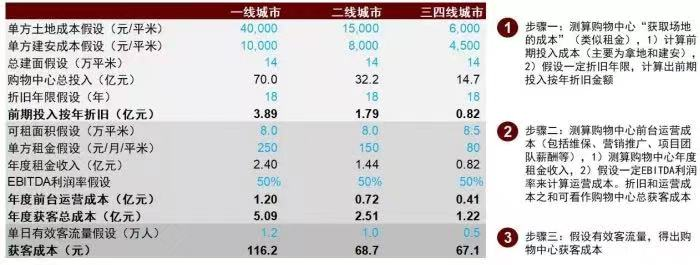
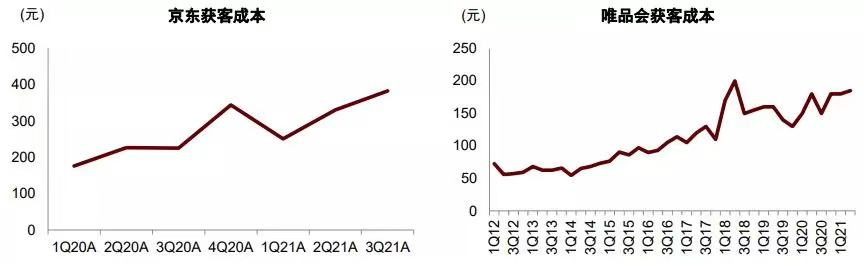

* 分品类看，家电、消费电子、宠物护理、美妆个护、服装和鞋类、药品的电商渗透率超过30%，且快速持续上升；而生鲜、调味品和餐食、米面粮油的电商渗透率不足15%。
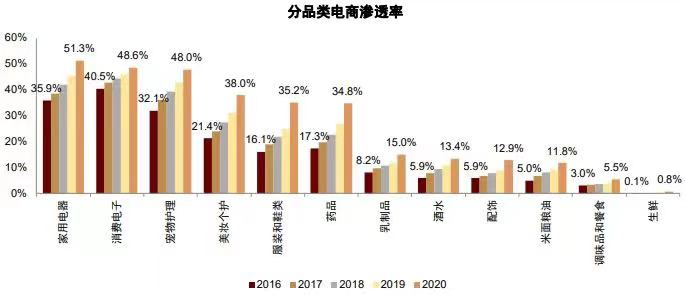

* 头部商管公司的盈利能力，关注**成本收益率**指标，即**EBITDA/总成本**，一般为6%-9%，华润最高（2020年8.8%）、龙湖较低（2020年6.2%）
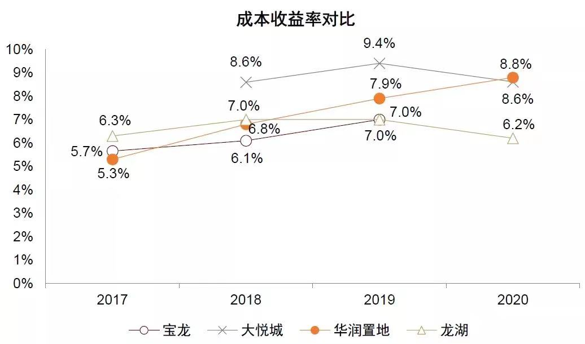

* 商业物业的融资渠道：
  * 经营贷：流程更快（银行一事一议），抵押率50%-60%，期限更长（10-15年），成本更高（5年起LPR上浮5-20%）
  * CMBS：流程更慢（交易所和证监会审核，向银行等投资者募集，期限和成本更灵活（3+3+...+3年，回售/赎回，重新约定利率)，成本低于主体信用债（因为有抵押）
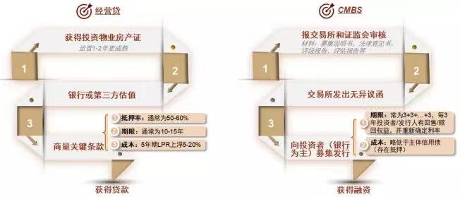

* 选城市：人口密集+收入水平高+消费意愿强（人多、会赚钱、爱花钱），关注**城镇居民人均消费支出**、**储蓄率**
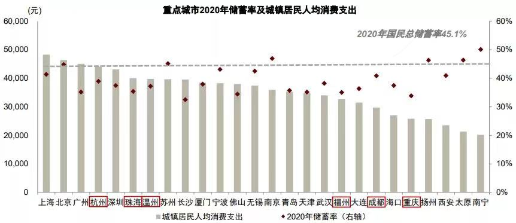

* 尽管整体消费不振，但头部购物中心的销售持续提速http://www.linkshop.com/news/2022481199.shtml，且跑赢社零。（样本为5年均有销售额数据的购物中心，存在幸存者偏差，数据来源为联商网）
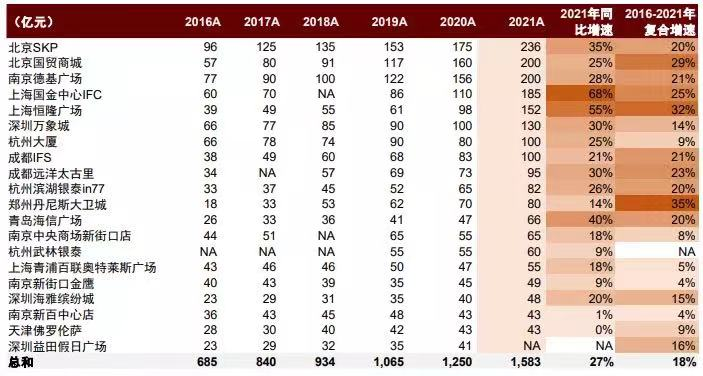

* 越高端的购物中心，销售与租金坪效越高，同店增速越快。
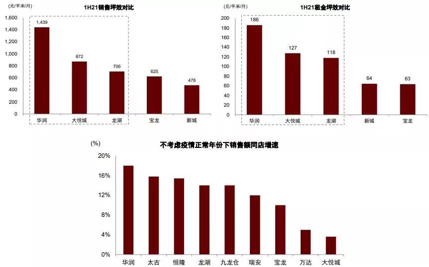

* 一些数据赋能的案例
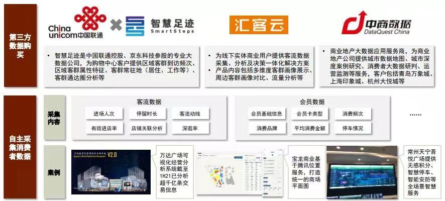

## REITs
#### 国内产业园区REITs的走势复盘与估值比较
标题：上市半年后再次飙涨，产业园区REITs价值几何？  
来源：https://mp.weixin.qq.com/s/fDMG-Dvh3rUDECNEFaIdQg  

* 我国产业园区REITs
  * 产业园区是各类基础设施REITs中最为重要的一类产品，由于产业园区是产业落地的基础载体，和实体经济发展关系极为密切。**在首批发行的9个REITs产品中占1/3。**
  * 我国产业园存量市场空间较广，是经济发展重要的载体，在长期经济潜在增速中枢下行、利率中枢下行通道中，存量资本化盘活可期。随着我国技术水平和信息化水平的提升，我国产业园也升级为以高新技术、信息科技、文创等知识密集型为主的高附加值产业。  

* *上市至今的表现复盘：先涨后跌再涨
  * 上市首日：均上涨，蛇口产业园溢价最高，达14.72%
  * 6/22 - 8月下旬，成交活跃度及价格均回落，苏州工业园等破发，可能原因有：
    * 品种较新，投资者对底层资产的估值逻辑、二级市场价格中枢及未来现金流分派有困惑，在前期观望为主
    * 初期阶段，部分机构未完善REITs交易系统，购买力缺失
    * 首日“打新”效应体现了股性，其实兼具债性，价格与成交量回落属于正常的价值回归
  * 8月下旬 - 年底，REITs价格明显上行，溢价均在20%左右，再创新高，可能原因有：
    * 经济下行+政策监管，股指回调+高收益债信用风险发酵，而优质债券收益不足（AAA级城投债信用利差持续收窄），挤压出一定资金配置需求；
    * 政策支持下投资者收益有保障  

* 当前估值是否合理？
  * 底层资产不会因为折旧贬值，不适用PE估值
  * PFFO（P/Funds from Operations）有NAREIT提出，REITs公司定期披露，可衡量REITs运营效益、真实剩余现金流和派息能力
  * PFFO = 净利润+分给少数股东权益的净利润+折旧摊销-资产处置收益
  * 2021年底的苏州工业园、蛇口产业园、张江光大园的2022年P/FFO为27.5、27.2和24.9倍
  * 美国2016-2020年产业园类REITsP/FFO均值26.4倍，基本合理
  * ARE（亚历山大房地产）是美国首个专注于生命科学行业的REITs，1997年上市，2019年营收15.3亿、市值264亿美元，P/FFO为17.7倍。

* 分红收益率是否合理？
  * 强制分红是REITs的特色，参考发达国家经验，REITs的合理分红回报率=10年期国债收益率+150至250bps
  * 产业园区REITs的合理收益率：
    * 我国10年国债3.25%（近3年2.9-3.6%，未来应该更低）
    * +150至250bps
    * 我国REITs合理股息率4.75-5.75%
    * -基础设施REITs收益率折价100-150bps
    * 我国基础设施REITs合理收益率3.75-4.75%
  * 3只产业园REITs发行价对应的股息收益率3.53-3.55%，低于合理收益率，表明投资者对于未来现金流成长性的预期偏乐观。
> **下一步：**计算已公告和已上市REITs的PFFO和分红收益率  
> **几个疑问：**与美国相比，我国REITs估值水平？与其他大类资产相比，我国REITs是否有吸引力？是谁在配REITs？新的税收优惠的影响？

#### 保租房REITs正式上路，行业参与门槛仍待降低
来源：https://mp.weixin.qq.com/s/EUKFrFoxtWwLpDQt2BwmPA
* 背景
  * 2022年4月13日，发改委收到全国收单保租房REITs项目，来自深圳市安居集团；2021年6月，保租房被纳入公募REITs试点
  * 在中国，REITs是由公募基金推出的信托产品，拥有底层不动产/基础设施所有权，收入来源为租金和不动产增值收益，定期现金分红
  * 中金预计，2022-2025你那，保租房开发投资额13万亿元
  * 保租房建设“十四五”一二线城市的重点工程，也是行业转型之路，但存在项目利润低、投资周期长问题
    * 按市场化的宅地或商办地价拿地，50年回本；按纯租赁用地（如上海地价仅30%）拿地，约20年回本
    * 因此，要吸引社会资金参与，需要完备的融资和退出机制
  * 沪深已上市REITs有12支，除平安广州广河下跌2.7%，其余上涨12.5%-48.5%，只要保租房REITs能问世，不担心买家
* 国家队是标配
  * 业内人士预估，迄今发改委拿到100+申报，只发出12单，通过率低，之后还要经过证监会和交易所（难度不大）
  * 深圳安居集团成立于2016年，深圳国资委100%出资控股，对标新加坡建屋发展局，从事公共住房投资建设和运营管理，已筹建公共住房占同期总量1/3，北京/上海承建保租房的是首创集团/上海城投
  * 为什么是国企央企？
    * 合规性较高，经营较稳健
    * 民企很难以大股东身份拿到优惠的纯租赁用地（R4），来源是本地国企的闲置用地，土地转性进入土拍市场，大多还是被国企拿走
  * 短期竞争少？
    * 2020年12月中央经济工作会议才定调“高度重视保租房建设”，按开发建设2年+运营3年，2025年才会有大量企业申报
    * 发起人的资产规模要求高，首次申报项目市场估值不低于10亿元（深圳安居11.58亿元），发起人持有的可发行REITs资产总规模不少于首次申报的2倍（深圳安居百亿元）
* 4%的分红门槛
  * 仅靠租金收入，多数保租房达不到4%的REITs分红水平（一年的运营净收入/上市价格，考核商业可投性），因为：
    * 各城市细则是低于同地段同品质市场租金的85%-95%
    * REITs项目净收入要先在企业端交税，拉低了回报率（海外REITs对企业免税，投资者拿到分红再交税）
    * 土地变性导致额外成本的不确定性，因为来源五花八门，地方政府可能要求补缴土地出让金才出具无偿划拨土地“无异议”函，村集体授权也有不确定性（北京未来50%供应是农村集体土地，广深很多来自城市更新或旧改）
  * 怎么办？
    * 核心区域或核心地段，99%出租率（深圳安居）
    * 政府补贴
* 租金的疑惑
  * 政府对“市场租金”的理解有两种，一是市场化长租公寓，如万科泊寓，二是当地民宅；从业务经营角度，应该是前者，参照前者定价9折还能盈利，后者相当于前者的6-7折，回报率没法看了
  * 新一线城市的租售比（月租/房价）比一线城市更高，发的REITs更容易达到4%分红水平

