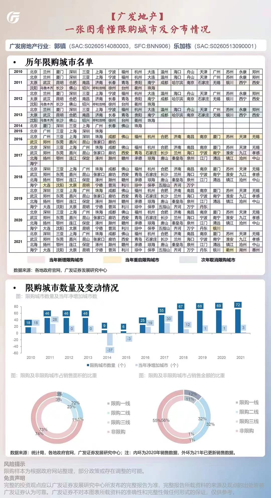

# 城市房地产市场相关
## 限购  
> 截至2021年的限购城市共72个，创2010年以来新高，当年新增3个；  
> 限购城市的销售面积（金额）占全国25%（45%）。  

广发_限购城市名单  

## 库存
标题：从库存角度看房地产的政策趋向与投资机会
来源：https://mp.weixin.qq.com/s/FQAiE4Ppm7sqUDvZvzwCsA
* 从绝对规模看，全国住宅库存水平没有达到2014年的历史高点。从相对规模看，考虑销售规模上升，去化周期自2017年以来维持在1.1年，并没有出现因投资过热导致的库存过剩现象，这与以往国内外房地产周期中，高供地叠加需求收缩导致房地产行业危机，有本质性差别，不能将本轮调整与历史上国内外任何一轮房地产危机简单类比。
* 经过5年（2016-2021年）去库存，存在南低北高特点（以黄河为界，华北、西北和东北的库存压力明显）。
* 部分困境房企的项目区域分布不均，导致：
  * 市场差的地方土储多，降价销售回笼资金
  * 市场好的地方土储少，裁员减编不拿地
  * 区域的现金流收支不匹配，需要集团层面调拨资金，受预售资金监管的影响大，引发流动性危机
* 库存不高，为什么市场下行？

