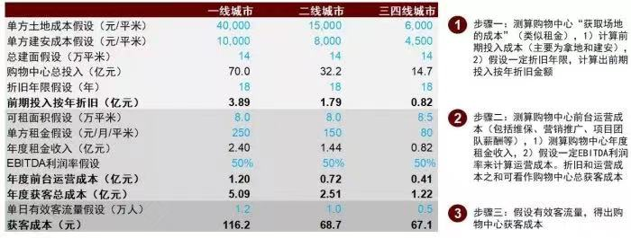
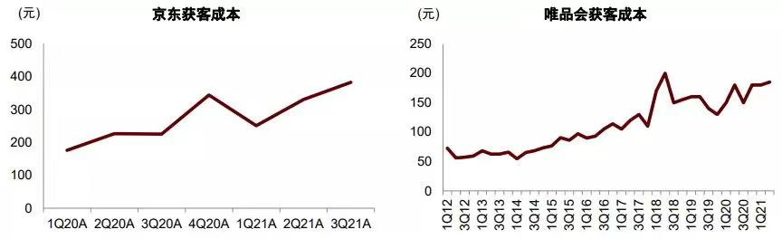
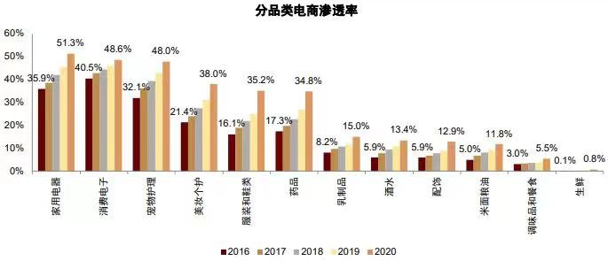
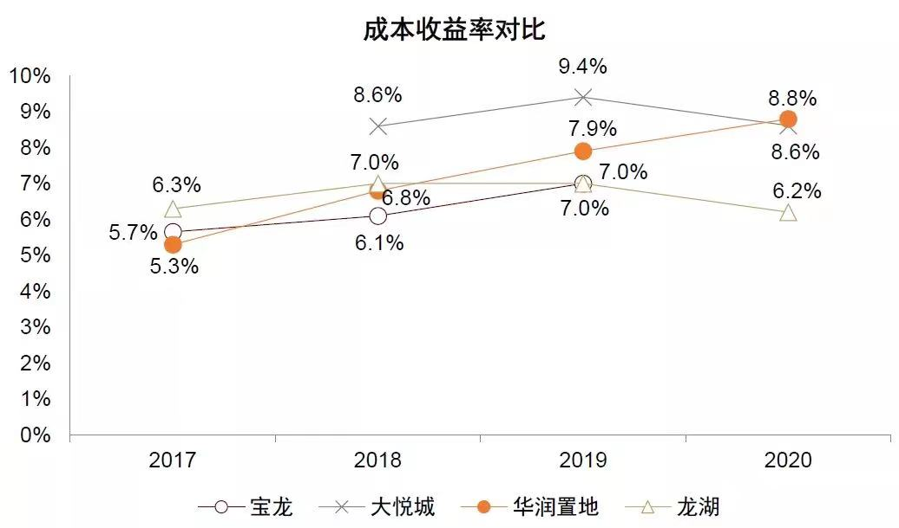
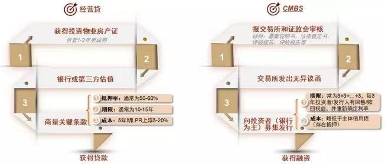
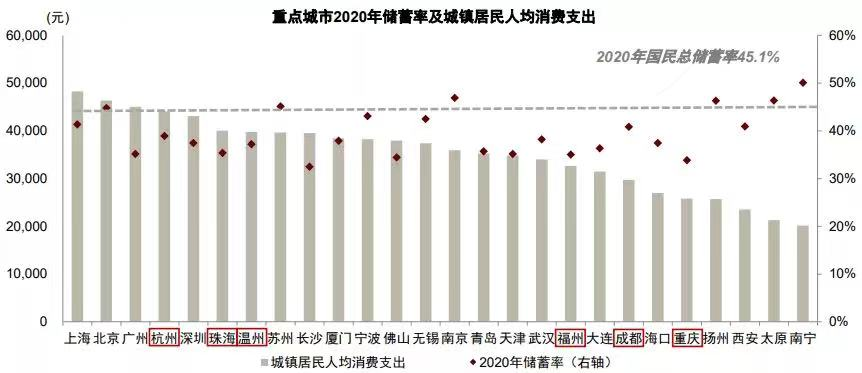
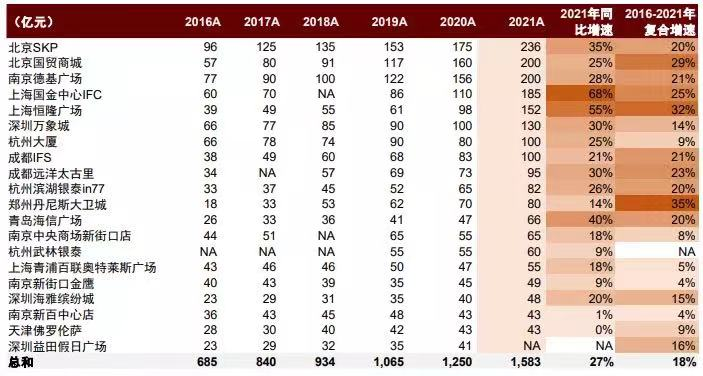
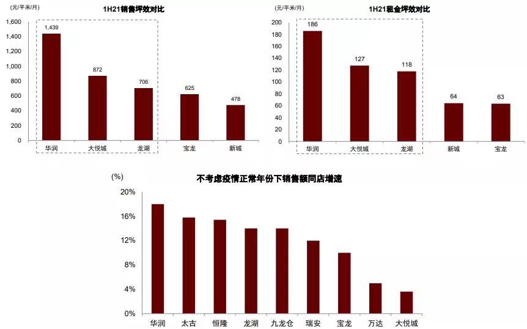
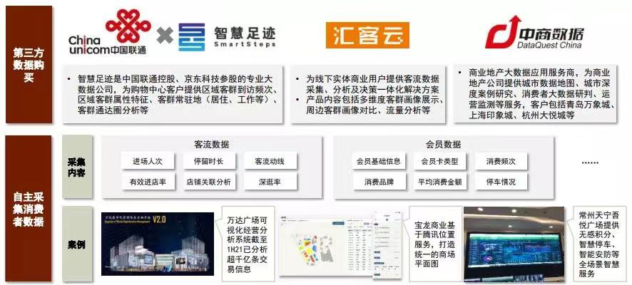

# 房地产新业态
## 购物中心  
### 中金房地产：洞察商管II：破局“老商业”，拥抱“新消费”  
> 随着线上流量红利消退，线下渠道对商家吸引力上升。  
* 测算显示，头部购物中心的获客成本约60-120元，已低于部分头部电商平台。

* 分品类看，家电、消费电子、宠物护理、美妆个护、服装和鞋类、药品的电商渗透率超过30%，且快速持续上升；而生鲜、调味品和餐食、米面粮油的电商渗透率不足15%。

* 头部商管公司的盈利能力，关注**成本收益率**指标，即**EBITDA/总成本**，一般为6%-9%，华润最高（2020年8.8%）、龙湖较低（2020年6.2%）

* 商业物业的融资渠道：
  * 经营贷：流程更快（银行一事一议），抵押率50%-60%，期限更长（10-15年），成本更高（5年起LPR上浮5-20%）
  * CMBS：流程更慢（交易所和证监会审核，向银行等投资者募集，期限和成本更灵活（3+3+...+3年，回售/赎回，重新约定利率)，成本低于主体信用债（因为有抵押）

* 选城市：人口密集+收入水平高+消费意愿强（人多、会赚钱、爱花钱），关注**城镇居民人均消费支出**、**储蓄率**

* 尽管整体消费不振，但头部购物中心的销售持续提速http://www.linkshop.com/news/2022481199.shtml，且跑赢社零。（样本为5年均有销售额数据的购物中心，存在幸存者偏差，数据来源为联商网）

* 越高端的购物中心，销售与租金坪效越高，同店增速越快。

* 一些数据赋能的案例

