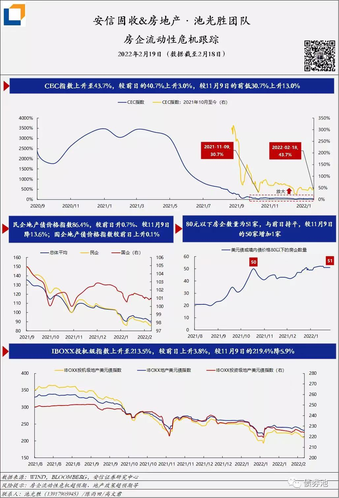

# 资本市场相关
## 房企流动性危机跟踪
> 安信固收+房地产：池光胜团队；  
> 截至2022年2月18日，美元债或境内债价格低于80元的房企为51家，较2021年11月9日的高点增加1家。  
安信_房企流动性危机跟踪  

## 房企违约名单  
值此虎年来临之际，违约及展期房企联合给债券市场拜年（以下排名不分先后）：  
中弘  
国购  
泰禾  
天房  
协信  
正源  
福晟  
三盛  
泛海  
鸿坤  
华夏幸福  
蓝光  
阳光100  
恒大  
新力  
花样年  
阳光城  
鑫苑  
奥园  
佳兆业  
当代  
富力  
禹洲  
荣盛  
大发  
世茂

